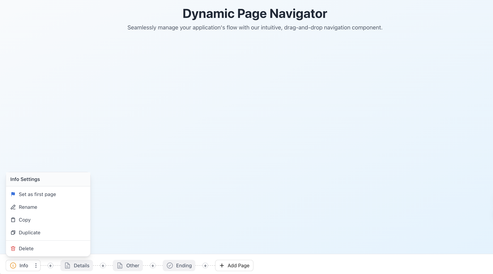

# Dynamic Page Navigator



An intuitive and dynamic page navigation component built with React and TypeScript. This component allows for seamless management of your application's flow with drag-and-drop reordering, dynamic page adding, and a clean, modern interface.

## Features

- **Drag-and-Drop Reordering:** Easily reorder pages with a smooth drag-and-drop interface.
- **Dynamic Page Management:** Add new pages to the navigation flow on the fly.
- **Active State Management:** Clear visual indicators for the currently active page.
- **Customizable Action Menus:** Each page item can have a context menu with custom actions.
- **Modern UI:** A clean and modern design built with Tailwind CSS.

## Getting Started

To get a local copy up and running, follow these simple steps.

### Prerequisites

- [Node.js](https://nodejs.org/en/) (v14 or later)
- [npm](https://www.npmjs.com/)

### Installation

1.  Clone the repo
    ```sh
    git clone https://github.com/matthew1996-dev/page-navigation-component.git
    ```
2.  Install NPM packages
    ```sh
    npm install
    ```
3.  Run the development server
    ```sh
    npm start
    ```

## Technologies Used

- [React](https://reactjs.org/)
- [TypeScript](https://www.typescriptlang.org/)
- [Tailwind CSS](https://tailwindcss.com/)
- [dnd-kit](https://dndkit.com/) for drag-and-drop functionality

This project is a React-based web application showcasing a dynamic and interactive page navigation component. It features drag-and-drop reordering, dynamic page creation, and context-sensitive action menus for each page item. The application also includes a component showcase section to demonstrate individual UI elements used within the navigator.

## Project Preview


## Features

### Navigator Component:
- **Page Display:** Displays a sequence of pages, each represented by a `StyledButton`.
- **Active State:** Clearly indicates the currently active/selected page.
- **Drag-and-Drop Reordering:** Allows users to reorder pages using `@dnd-kit/core` and `@dnd-kit/sortable`.
- **Dynamic Page Addition:** Users can add new pages to the navigator sequence via an `AddButton` interspersed between page items.
- **Action Menus:** Each active page item has an associated `ActionMenu` (three-dots icon) providing options like 'Set as first page', 'Rename', 'Duplicate', and 'Delete'.
- **Responsive Design:** The navigator is housed in a fixed footer, adapting to available width with horizontal scrolling if needed.

### Component Showcase:
- Demonstrates various states of the `StyledButton` (inactive, active, hover/focus).
- Showcases the `ActionMenu` functionality, both attached to a `StyledButton` and as a standalone toggle.
- Displays miscellaneous UI elements like `Chain` connectors, `AddButton`, and various SVG icons.
- Organized in a responsive 3-column grid layout with distinct cards for clarity.

## Tech Stack

- **React:** Core library for building the user interface.
- **TypeScript:** For static typing and improved developer experience.
- **Tailwind CSS:** Utility-first CSS framework for styling.
- **@dnd-kit:** Modern, lightweight, and extensible drag-and-drop toolkit for React.
  - `@dnd-kit/core`
  - `@dnd-kit/sortable`
- **Create React App:** Project setup and build tooling.

## Key Components

- **`App.tsx`:** The main application component, orchestrating the navigator and the component showcase.
- **`Navigator.tsx`:** Manages the display and drag-and-drop functionality of page items.
- **`StyledButton.tsx`:** A versatile button component used for page items, supporting active states, dynamic widths, and an action menu trigger.
- **`ActionMenu.tsx`:** A popover menu component providing contextual actions.
- **`Chain.tsx`:** Visual connector (dashed line) used between page items in the navigator.
- **`AddButton.tsx`:** A '+' button used to trigger the addition of new pages.
- **Icon Components (`src/components/icons/`)**: Various SVG icons used throughout the application.

## Getting Started

### Prerequisites

- Node.js (v14.x or later recommended)
- npm (v6.x or later) or yarn

### Installation & Setup

1.  **Clone the repository (if applicable):**
    ```bash
    git clone <repository-url>
    cd page-navigation-component
    ```

2.  **Install dependencies:**
    ```bash
    npm install
    ```
    or
    ```bash
    yarn install
    ```

### Running the Application

1.  **Start the development server:**
    ```bash
    npm start
    ```
    This will run the app in development mode.
    Open [http://localhost:3000](http://localhost:3000) to view it in your browser.

    The page will automatically reload if you make edits. You will also see any lint errors in the console.

## Available Scripts

In the project directory, you can run:

-   **`npm start`**: Runs the app in development mode.
-   **`npm test`**: Launches the test runner in interactive watch mode.
-   **`npm run build`**: Builds the app for production to the `build` folder.
-   **`npm run eject`**: Removes the single build dependency and copies configuration files (webpack, Babel, ESLint, etc.) into your project for full control. **Note: this is a one-way operation.**

## Learn More

This project was bootstrapped with [Create React App](https://github.com/facebook/create-react-app).
- To learn React, check out the [React documentation](https://reactjs.org/).
- For more information about Create React App, see the [Create React App documentation](https://facebook.github.io/create-react-app/docs/getting-started).
